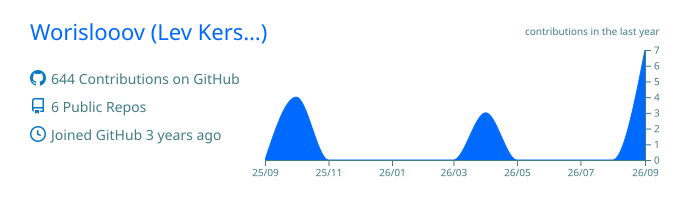
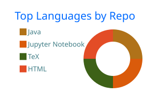
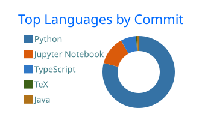
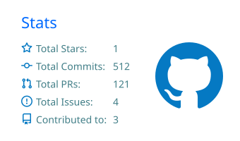
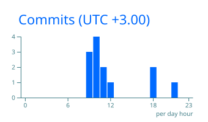

  

  

    
    
    
  

---

### Образование

* **НИЯУ МИФИ** — Институт лазерных и плазменных технологий (ЛаПлаз)  
  *Направление:* Квантовый инжиниринг (1 курс)  
  *Область интересов:* Численное моделирование физических систем, методы машинного обучения и анализа данных.

---

### Стек технологий

<table>
  <tr>
    <td width="25%"><strong>Data Science & Analytics</strong></td>
    <td>
      
      
      
      
    </td>
  </tr>
  <tr>
    <td width="25%"><strong>Visualization</strong></td>
    <td>
      
      
    </td>
  </tr>
  <tr>
    <td width="25%"><strong>Backend & Data</strong></td>
    <td>
      
      
    </td>
  </tr>
  <tr>
    <td width="25%"><strong>Tools & Environment</strong></td>
    <td>
      
      
      
    </td>
  </tr>
</table>

---

### Ключевые результаты и достижения

| Событие / Соревнование | Результат |
| :--- | :--- |
| Nuclear IT Hack 2025 (НИЯУ МИФИ) | Победитель (1-е место) |
| Всероссийская олимпиада DANO | Победитель в командном зачете |
| Хакатоны DANO | 3-е место (дважды) |
| Олимпиада «Росатом» по математике | Призёр |
| Идеатон НИУ ВШЭ | Призёр |
| Кейс-чемпионат DEADLINE (2025, 2026) | Финалист |

---

### Статистика профиля

  

 

  
  
   
  

 

  

---

### Детальная аналитика

  

 

  
  

  
  

---

  

